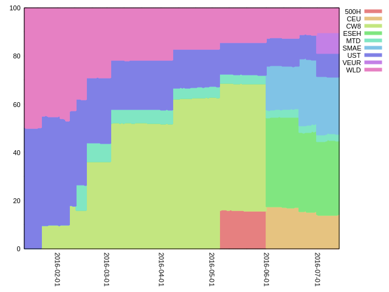
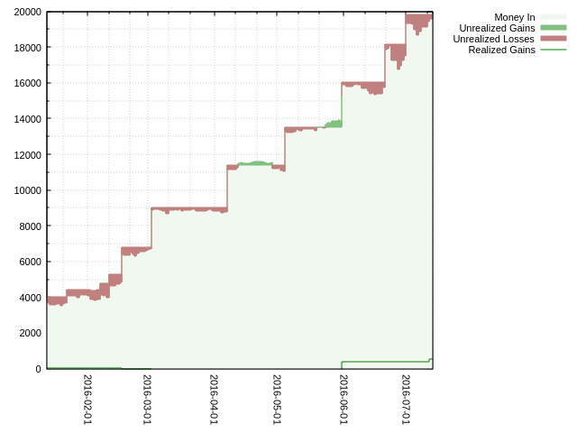
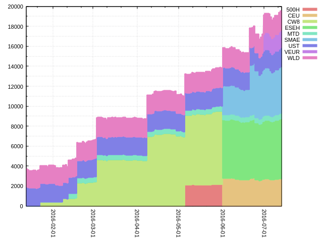
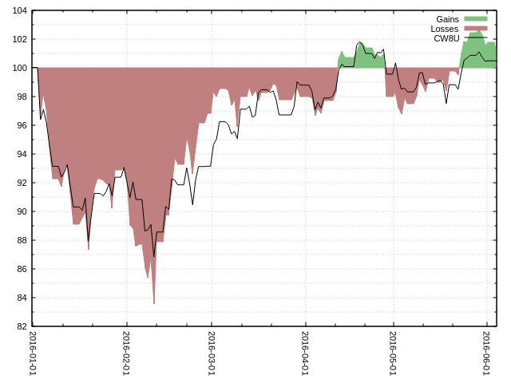

# pfm

A simple command-line stock portfolio manager.

Released under the WTFPLv2 license.

# Dependencies

* PHP ≥ 7 (cli)
* Gnuplot

# Screenshots

 

 

~~~
Silmeria ~ % pfm
  Tkr |  %Wgt |    Price |    Quantity |    Money In |    Realized |  Unrealized
------+-------+----------+-------------+-------------+-------------+------------
 ESEH | 30.76 |   103.71 |     58.0000 |     5843.91 |       -5.24 |      171.10
 SMAE | 23.86 |   111.12 |     42.0000 |     5055.90 |      117.14 |     -388.86
  CEU | 13.93 |   181.65 |     15.0000 |     2768.85 |       -3.80 |      -44.17
  WLD | 10.34 |   151.56 |     13.3374 |     2053.36 |        2.30 |      -32.01
  UST |  9.73 |    16.25 |    117.1845 |     1960.63 |       10.63 |      -56.97
 VEUR |  8.73 |    26.68 |     64.0000 |     1654.40 |       -2.90 |       52.80
  MTD |  2.65 |   174.29 |      2.9768 |      499.75 |       -0.25 |       19.09
  CW8 |       |          |             |             |      372.51 |            
 500H |       |          |             |             |       26.80 |            
------+-------+----------+-------------+-------------+-------------+------------
  TOT |       |          |             |    19836.79 |      517.18 |     -279.02
~~~

~~~
Silmeria ~ % pfm perf
  Ticker |   MtD |   May |   Apr |   Mar |   YtD |  2015 |  2014 |  2013 |   All
---------+-------+-------+-------+-------+-------+-------+-------+-------+------
    500H | -0.36 |  1.63 |       |       |       |       |       |       |      
     CEU | -1.21 |       |       |       | -1.21 |       |       |       | -1.21
     CW8 |  0.27 |  3.40 |  0.46 |  0.15 |       |       |       |       |      
    ESEH | -0.04 |       |       |       | -0.04 |       |       |       | -0.04
     MTD |  0.28 |  1.07 | -1.03 |  0.48 |  2.18 |       |       |       |  2.18
    SMAE | -0.20 |       |       |       | -0.20 |       |       |       | -0.20
     UST | -1.71 |  7.46 | -4.55 |  0.54 | -7.26 |  1.25 |       |       | -6.26
     WLD | -1.26 |  3.44 |  0.18 |  0.95 | -3.19 | -0.37 |       |       | -3.54
---------+-------+-------+-------+-------+-------+-------+-------+-------+------
   TOTAL | -0.54 |  3.56 | -0.46 |  0.43 |  1.00 |  0.44 |       |       |  1.11
~~~

# Usage

## Status view (`status`, default)

Parameters:

* `at:<date>`: see a past snapshot of the portfolio. Use a
  `strtotime()`-parseable format. For example, `at:2016-01-01` will
  show the porfolio (and the prices) as they were on january 1, 2016.

Columns:

* `Tkr`: the line ticker
* `%Wgt`: weight of this line in your portfolio
* `Price`: the current price of the stock
* `Quantity`: number of stocks you own
* `Money In`: total amount of money you spent on this stock
* `Realized`: realized gain (actual gain/loss you already got in cash)
* `Unrealized`: unrealized gain (theoretical gain/loss you would get by selling now)

## Performance view (`perf`)

Parameters:

* `at:<date>`: see above
* `columns:default|days|weeks|months|years` use custom columns instead of the defaults

Columns:

* `Ticker`: the line ticker
* `MtD`: performance of this line month-to-date (ie from beginning of the month to today)
* `May`, `Apr`, `Apr`: performance of this line over the last 3 months
* `YtD`: performance of this line year-to-date (ie from beginning of the year to today)
* `2015`, `2014`, `2013`: performance of this line over the last 3 years
* `All`: overall performance of this line

Performances are calculated using [IRR (internal rate of
return)](https://en.wikipedia.org/wiki/Internal_rate_of_return)
calculation.

## Performance graph (`plot-perf`)

~~~
Silmeria ~ % pfm plot-perf start:2016-01-01
~~~

Parameters:

* `start:<date>`
* `end:<date>`
* `absolute:0|1`: default is relative (0), absolute will show buy/sell operations and overall portfolio value
* `raw:0|1`: if `1`, don't invoke `gnuplot` and print the raw data, useful if you want to use another tool to generate a chart

## Portfolio graph (`plot-pf`)

Same parameters as `plot-perf`.

## Transactions view (`ls-tx`)

Parameters:

* `ticker:<ticker>`: only show transactions on this line
* `before:<date>`: only show transactions before this date (`strtotime()`-formatted)
* `after:<date>`: only show transactions after this date (`strtotime()`-formatted)

## Add transaction (`add-tx`)

~~~
Silmeria ~ % pfm add-tx ticker:SMAE date:2016-06-01 buy:24 price:121.78 total:2926.52
~~~

Parameters:

* `ticker:<ticker>`: required
* `date:<date>`: optional, use `now` as default (`strtotime()`-formatted)
* `buy:<qty>` or `sell:<qty>`: optional, can use `sell:all` to sell all remaining shares
* `price:<unit-price>`: optional
* `fee:<fee>`: optional
* `total:<total>`: optional

Must have exactly three of: `buy` (or `sell`), `price`, `fee` and
`total`. The fourth value will be computed using the **transaction
equation**:

~~~
total = (-quantity) * price - fee
~~~

Where quantity is positive for buying, negative for selling. When
buying, set user-supplied `total` as negative.

## Remove transaction(s) (`rm-tx`)

~~~
Silmeria ~ % pfm rm-tx 7 10 12
~~~

Get transaction IDs using `ls-tx`.

## Lines view (`ls-lines`)

~~~
Silmeria ~ % pfm ls-lines        
                                      Name |  Tkr | Cur |   Yahoo |         ISIN
-------------------------------------------+------+-----+---------+-------------
           AMUNDI ETF MSCI WORLD UCITS ETF |  CW8 | EUR |  CW8.PA | FR0010756098
~~~

## Add line (`add-line`)

~~~
Silmeria ~ % pfm add-line ticker:CW8 currency:EUR isin:FR0010756098 'name:AMUNDI ETF MSCI WORLD UCITS ETF'
~~~

Parameters:

* `name:<name>`: required
* `ticker:<ticker>`: required, must be unique
* `currency:<currency-code>`: required, but unused at the moment (TODO)
* `isin:<isin>`: optional, ISIN code of the stock (used for quotes & price history)

## Remove line (`rm-line`)

~~~
Silmeria ~ % pfm rm-line ticker:CW8
~~~
